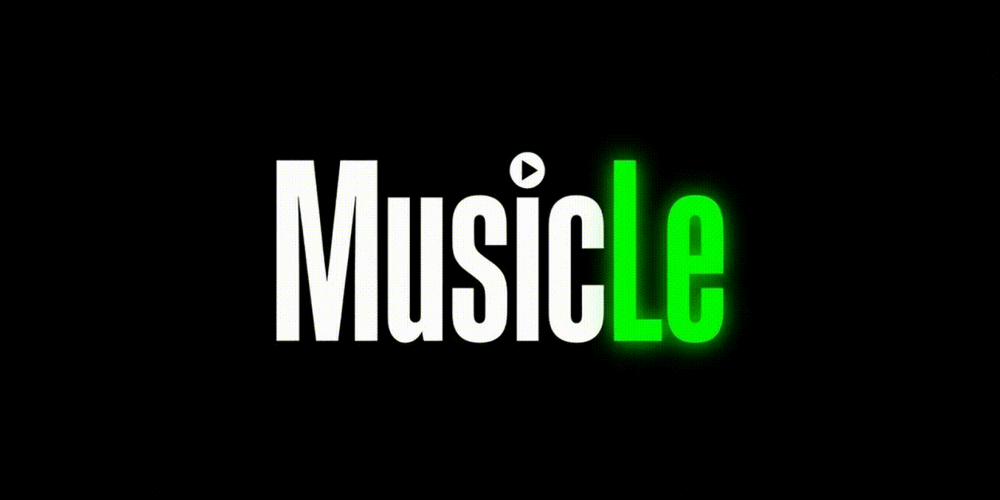
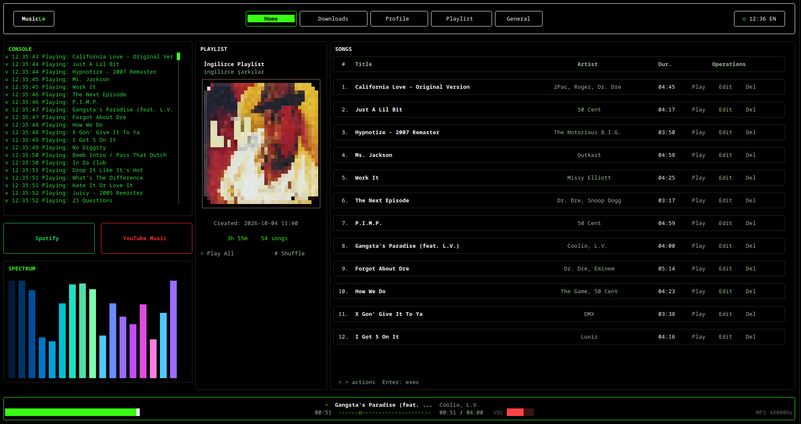

# MusicLe CLI

A Spotify-inspired music player and personal library manager that runs in your terminal (Go + Bubble Tea).



## Features

- Download tracks and playlists from Spotify and YouTube links (bundled yt-dlp + FFmpeg, 320 kbps MP3 + cover art)
- Song list, profile and playlist management; entries are stored in `song_list.txt`
- The playing track's cover art is shown automatically on the main screen
- Spectrum visualizer, scrolling lyrics and volume bars
- 11 languages: Turkish, English, Español, Deutsch, Français, العربية, Português, 中文, 日本語, Italiano, Русский
- Theme and spectrum palette options, output device and volume limit settings
- Browser connector: import playlists from an open Spotify / YouTube Music tab
- Keyboard shortcuts: F1 change focus, F2 change view, F3 settings tab, ↑↓ volume, ←→ seek 5s, Space play/pause, Esc home
- Single-file installs: AppImage / .exe / tar.gz for Windows, macOS and Linux

## Installation

Build and run the project locally:

```bash
git clone https://github.com/colgecen/MusicLeCLI.git
cd MusicLeCLI
go build -o musicle-cli .
```

To produce packages with the menu-driven build tool:

```bash
musiclecli
```

Pick a target and format (Linux: AppImage/RPM/tar.gz/binary, Windows: .exe/.exe+zip, macOS: tar.gz/binary).
Prebuilt binaries are on the [releases](https://github.com/colgecen/MusicLeCLI/releases) page.

## Usage

Run it with:

```bash
./build/musicle-cli
```

Paste a Spotify or YouTube link into the Download tab and choose the target playlist; the tracks show up in your library once the download finishes. On the main screen browse the list with `↑↓` and press `Enter` to play, press `F1` to focus the player bar for volume and seeking, and change language, theme and audio output from the Settings tab.

Configuration lives in `~/.config/musicle/config.json`, the music archive under `~/Music/MusicLe/`.

## Screenshots



## License

This project is licensed under the [Apache-2.0](LICENSE) license.
